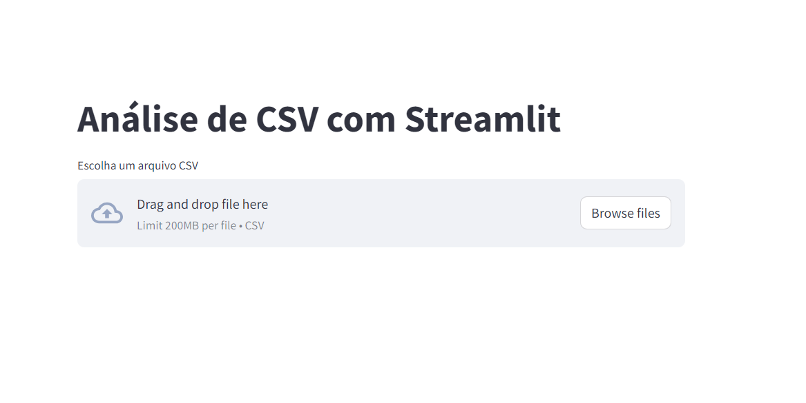
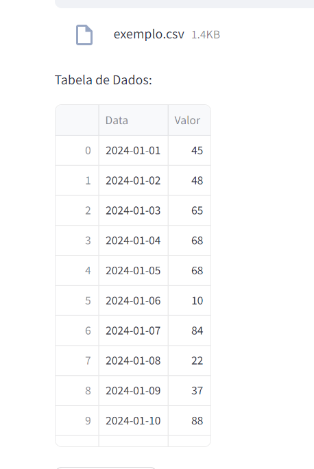
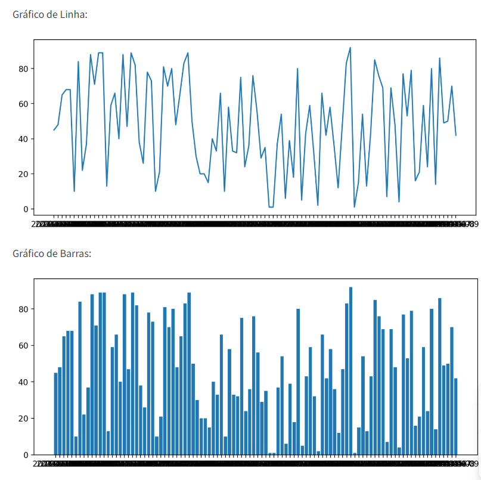

<h1 align="center">
     <a href="#" alt="Doker hub"> Docker com streamlit(exemplo) </a>
</h1>

<h3 align="center">
    !! Repositorio usado como exemplo para subir uma aplicação streamlit no $${\color{red}docker$$com$$git}$$.
</h3>

<h4 align="center">
	🚧   Em andamento 🚀 🚧
</h4>

Tabela de conteúdos
=================
<!--ts-->
   * [Sobre o projeto](#-sobre-o-projeto)
   * [Funcionalidades](#%EF%B8%8F-funcionalidades)
   * [Aplicação](#-aplicação) 
     * [inicio](#inicio)
     * [graficos](#graficos) 
   * [Como executar o projeto](#-como-executar-o-projeto)
     * [Pré-requisitos](#pré-requisitos)
     * [🎲 Rodando o codigo (servidor)](#-rodando-o-codigo-servidor)     
   * [Tecnologias](#-tecnologias) 
   * [Contribuidores](#-contribuidores)
   * [Como contribuir no projeto](#-como-contribuir-no-projeto)
   * [Autor](#-autor)
   * [Licença](#user-content--licença)
<!--te-->


## 💻 Sobre o projeto


Este projeto consiste em uma aplicação desenvolvida em Streamlit que permite ao usuário enviar um arquivo CSV simples. A partir deste CSV, a aplicação gera uma tabela e dois gráficos, proporcionando uma visualização interativa e fácil de dados. O diferencial deste projeto é sua implantação usando Docker, garantindo uma execução consistente e isolada em qualquer ambiente. 
Além disso, a aplicação é hospedada no Render, uma plataforma em nuvem, tornando-a acessível via web. Este projeto combina análise de dados, visualização, conteinerização e hospedagem em nuvem de forma integrada.

---

## ⚙️ Funcionalidades

- [x] Upload de Arquivo CSV:
  - Interface para o usuário carregar um arquivo CSV
  - Verificação de validade do formato do arquivo.
- [x] Geração de Tabela e Gráficos 
  - Exibição de dados em formato de tabela.
  - Criação de dois tipos de gráficos a partir dos dados do CSV.
  - Gráfico 1: [Grafico de barras no tempo]
  - Gráfico 2: [Grafico de linhas no tempo]
- [x] Integração com Docker
  - Conteinerização da aplicação para garantir consistência entre diferentes ambientes de execução.
- [x] Hospedagem no Render
  - Configuração para implantação e hospedagem na plataforma em nuvem Render.
  - Acesso web à aplicação hospedada.
  
---

## 🎨 Aplicação

A aplicação está disponível no link abaixo:

<a href="https://docker-tests-b30u.onrender.com/">
  
</a>


### Inicio

<p align="center">
  

  
</p>

### Graficos

<p align="center" style="display: flex; align-items: flex-start; justify-content: center;">
  
</p>

---

## 🚀 Como executar o projeto

Este projeto é divido em três partes:
1. Clonar o repositorio 
2. Instalar as dependencias
3. Instalar docker

💡Com docker instalado , basta acessar os diretorios de cada parte do projeto e rodar os seguintes comandos:

### Pré-requisitos

Antes de começar, você vai precisar ter instalado em sua máquina as seguintes ferramentas:
[Git](https://git-scm.com), [python](https://www.python.org/),[Docker](https://www.docker.com/). 
Além disto é bom ter um editor para trabalhar com o código como [VSCode](https://code.visualstudio.com/)

#### 🎲 Rodando o codigo (servidor)

```bash

# Clone este repositório
$ git clone https://github.com/alexlimap/docker_tests

# Acesse a pasta do projeto no terminal/cmd
$ cd README

# Vá para a pasta server
$ cd server

# Instale as dependências
$ poetry install

# Execute a aplicação em modo de desenvolvimento
$ docker run dev:server

# O servidor inciará na porta:8501 - acesse http://localhost:8501 

```

---

## 🛠 Tecnologias

As seguintes ferramentas foram usadas na construção do projeto:

#### **Web**  ([python](https://www.python.org/)  +  [streamlit](https://streamlit.io/))

-   **[python](https://www.python.org/)**
-   **[Streamlit](https://streamlit.io/)**
-   **[docker](https://www.docker.com/)**
-   **[render](https://render.com/)**

> Veja o arquivo  [render](https://docker-tests-b30u.onrender.com/)


---

## 👨‍💻 Contribuidores

Quem quiser da um up no projeto é so seguir os passos abaixo.


## 💪 Como contribuir no projeto

1. Faça um **fork** do projeto.
2. Crie uma nova branch com as suas alterações: `git checkout -b my-feature`
3. Salve as alterações e crie uma mensagem de commit contando o que você fez: `git commit -m "feature: My new feature"`
4. Envie as suas alterações: `git push origin my-feature`
> Caso tenha alguma dúvida confira este [guia de como contribuir no GitHub](./CONTRIBUTING.md)

---

## 🦸 Autor
---

<a href="https://www.linkedin.com/in/alexandre-lima-47b63755/">
 
 <br />
 <sub><b>Alexandre Lima</b></sub></a> <a href="https://www.linkedin.com/in/alexandre-lima-47b63755/" title="Treinamento">🚀</a>


Feito para fins de estudo por Alexandre Lima 👋🏽 Entre em contato!

[](https://www.linkedin.com/in/alexandre-lima-47b63755/) 
[](mailto:alexandrepompeu@gmail.com)

---

## 📝 Licença

Este projeto esta sobe a licença [MIT](./LICENSE).

---


