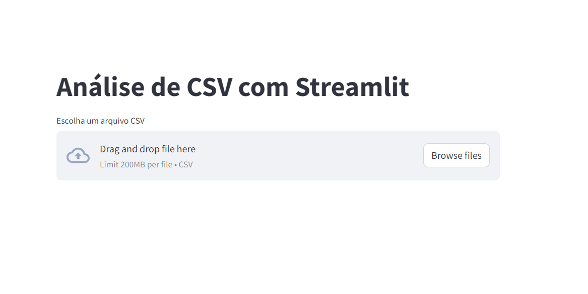
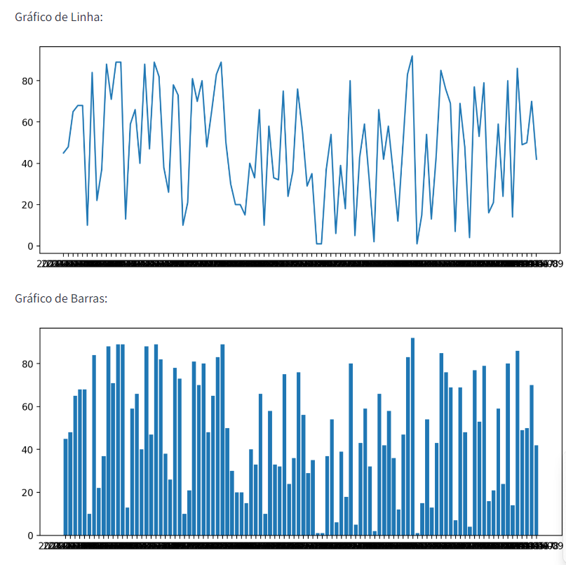

<h1 align="center">
     <a href="#" alt="site do ecoleta"> Docker exemplo </a>
</h1>

<h3 align="center">
    Repositorio usado como exemplo para subir uma aplicação streamlit no docker. 💚
</h3>

<h4 align="center">
	🚧   Em andamento 🚀 🚧
</h4>

Tabela de conteúdos
=================
<!--ts-->
   * [Sobre o projeto](#-sobre-o-projeto)
   * [Funcionalidades](#-funcionalidades)
   * [Layout](#-layout) -->
     * [inicio](#inicio)
     * [graficos](#graficos) -->
   * [Como executar o projeto](#-como-executar-o-projeto)
     * [Pré-requisitos](#pré-requisitos)
     * [🎲 Rodando o codigo (servidor)](#🎲-Rodando-o-codigo-(servidor))     
   * [Tecnologias](#-tecnologias)
     * [Web](#user-content-website--react----typescript)  
   * [Contribuidores](#-contribuidores)
   * [Como contribuir no projeto](#-como-contribuir-no-projeto)
   * [Autor](#-autor)
   * [Licença](#user-content--licença)
<!--te-->


## 💻 Sobre o projeto


Este projeto consiste em uma aplicação desenvolvida em Streamlit que permite ao usuário enviar um arquivo CSV simples. A partir deste CSV, a aplicação gera uma tabela e dois gráficos, proporcionando uma visualização interativa e fácil de dados. O diferencial deste projeto é sua implantação usando Docker, garantindo uma execução consistente e isolada em qualquer ambiente. 
Além disso, a aplicação é hospedada no Render, uma plataforma em nuvem, tornando-a acessível via web. Este projeto combina análise de dados, visualização, conteinerização e hospedagem em nuvem de forma integrada.

---

## ⚙️ Funcionalidades

- [x] Upload de Arquivo CSV:
  - [x] Interface para o usuário carregar um arquivo CSV
  - [x] Verificação de validade do formato do arquivo.
- [x] Geração de Tabela e Gráficos 
  - [x]Exibição de dados em formato de tabela.
  - [x]Criação de dois tipos de gráficos a partir dos dados do CSV.
  - [x]Gráfico 1: [Descrição do tipo de gráfico e o que ele representa]
  - [x]Gráfico 2: [Descrição do tipo de gráfico e o que ele representa]
- [x]Integração com Docker
  - [x]Conteinerização da aplicação para garantir consistência entre diferentes ambientes de execução.
- [x]Hospedagem no Render
  - [x]Configuração para implantação e hospedagem na plataforma em nuvem Render.
  - [x]Acesso web à aplicação hospedada.
  
---

## 🎨 Layout

O layout da aplicação está disponível no link abaixo:

<a href="https://docker-tests-b30u.onrender.com/">
  
</a>


### inicio

<p align="center">
  

  
</p>

### graficos

<p align="center" style="display: flex; align-items: flex-start; justify-content: center;">
  
</p>

---

## 🚀 Como executar o projeto

Este projeto é divido em três partes:
1. Clonar o repositorio 
2. Instalar as dependencias
3. Instalar docker

💡Com docker instalado , basta acessar os diretorios de cada parte do projeto e rodar os seguintes comandos:

### Pré-requisitos

Antes de começar, você vai precisar ter instalado em sua máquina as seguintes ferramentas:
[Git](https://git-scm.com), [python](https://www.python.org/),[Docker](https://www.docker.com/). 
Além disto é bom ter um editor para trabalhar com o código como [VSCode](https://code.visualstudio.com/)

#### 🎲 Rodando o codigo (servidor)

```bash

# Clone este repositório
$ git clone git@github.com:tgmarinho/README-ecoleta.git

# Acesse a pasta do projeto no terminal/cmd
$ cd README-ecoleta

# Vá para a pasta server
$ cd server

# Instale as dependências
$ npm install

# Execute a aplicação em modo de desenvolvimento
$ npm run dev:server

# O servidor inciará na porta:3333 - acesse http://localhost:3333 

```
<p align="center">
  <a href="https://github.com/tgmarinho/README-ecoleta/blob/master/Insomnia_API_Ecoletajson.json" target="_blank"></a>
</p>


## 🛠 Tecnologias

As seguintes ferramentas foram usadas na construção do projeto:

#### **Web**  ([python](https://www.python.org/)  +  [streamlit](https://streamlit.io/))

-   **[python](https://www.python.org/)**
-   **[Streamlit](https://streamlit.io/)**
-   **[docker](https://www.docker.com/)**
-   **[render](https://render.com/)**

> Veja o arquivo  [render](https://docker-tests-b30u.onrender.com/)


---

## 👨‍💻 Contribuidores

💜 Um super thanks 👏 para essa galera que fez esse produto sair do campo da ideia e entrar nas lojas de aplicativos :)


## 💪 Como contribuir no projeto

1. Faça um **fork** do projeto.
2. Crie uma nova branch com as suas alterações: `git checkout -b my-feature`
3. Salve as alterações e crie uma mensagem de commit contando o que você fez: `git commit -m "feature: My new feature"`
4. Envie as suas alterações: `git push origin my-feature`
> Caso tenha alguma dúvida confira este [guia de como contribuir no GitHub](./CONTRIBUTING.md)

---

## 🦸 Autor

<a href="https://www.linkedin.com/in/alexandre-lima-47b63755/">
 
 <br />
 <sub><b>Thiago Marinho</b></sub></a> <a href="https://www.linkedin.com/in/alexandre-lima-47b63755/" title="Linkedin">🚀</a>
 <br />


---

## 📝 Licença

Este projeto esta sobe a licença [MIT](./LICENSE).

Feito com ❤️ por Alexandre Lima 👋🏽 [Entre em contato!](https://www.linkedin.com/in/alexandre-lima-47b63755/)

---


